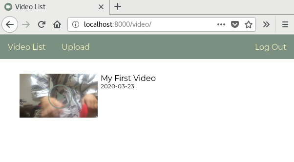
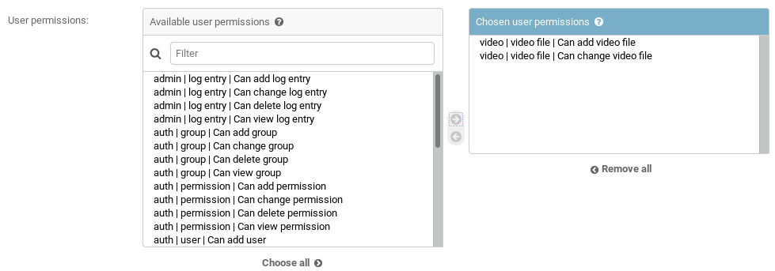

# Homestream



## What?

A personal video hosting platform. Privileged users may upload videos. Other users may watch the uploaded videos.

## Why?

I have a collection of home movies on my home server and I would like to have remote access to it. I would also like to give certain friends and family members _limited_ access to it.

## How?

Ensure that you have Git, [Docker](http://www.docker.com) and [Docker-Compose](https://docs.docker.com/compose/install/) installed in your environment.

1. Clone this repository

```bash
git clone https://github.com/dliberat/homestream.git
```

2. Enter the home directory

```bash
cd ./homestream
```

3. Launch the server

To launch the development server:

```bash
docker-compose up
```

To launch the production environment:

```bash
docker-compose -f docker-compose.prod.yml up
```

The first time you perform these actions Docker will download and build the images required for this project. It may take several minutes for these operations to finish.

4. Launch the web app

To view the app, navigate to the appropriate location in your web browser.

__Development mode:__ http://localhost:8000/video/
__Production mode:__ http://localhost:34500/video/

## Uploading videos

Users need appropriate permissions to upload videos. When you launch the development server, three test users will be created automatically. The `admin` user has admin rights and may upload videos. The `alice` and `bob` users can watch videos that `admin` has posted, but may not upload videos of their own. If you launch the production environment you will need to manually create a superuser. Assuming the `web` container has a container name of `homestream_web_1`, you can run the Django user creation tool with the following command:

```bash
docker exec -it homestream_web_1 python manage.py createsuperuser
```

Adding new users should be done via the Django admin interface. To allow users to upload videos, they should be assigned the `video | video_file | Can add video file` and `video | video_file | Can change video file` permissions. It is recommended that the site administrator create a group with these permissions and add users to that group as needed.



## Environment variables

The default configuration requires three separate files for environmental variables: `.env.dev`, `.env.prod`, and `.env.db`.
`.env.dev` and `.env.prod` contain environmental variables that are either used for the startup scripts or that get passed to Django's settings config. `.env.db` contains variables that are provided to the database container. In the default configuration, this file is shared between the development and production environments.

__Note:__: `.env.prod` is not included in this repository. You will need to create it yourself.

### .env.dev / .env.prod
|Variable             | Values |
|---------------------|--------|
|DEBUG                | 1 for debug mode, or 0 for production |
|SECRET_KEY           | As per settings.py |
|DJANGO_ALLOWED_HOSTS | As per settings.py |
|SQL_ENGINE           | As per settings.py |
|SQL_DATABASE         | As per settings.py |
|SQL_USER             | As per settings.py |
|SQL_PASSWORD         | As per settings.py |
|SQL_HOST             | As per settings.py |
|SQL_PORT             | As per settings.py |
|DATABASE             | Name of database being used. If the name is "postgres", the startup script will wait until postgres is listening before launching the web server.|

### .env.db
| Variable         | Values                                           |
|------------------|--------------------------------------------------|
|POSTGRES_DB       | Should match the `SQL_DATABASE` variable above.  |
|POSTGRES_USER     | Should match the `SQL_USER` variable above.      |
|POSTGRES_PASSWORD | Should match the `SQL_PASSWORD` variable above.  |